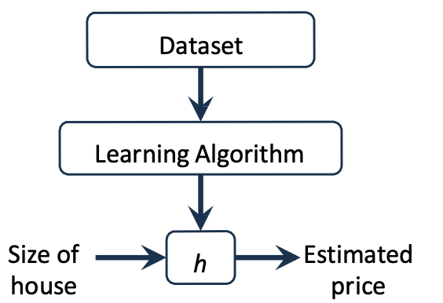

A regression algorithm can generate a value, a float, based on the input data.
This algorithm is trained by giving some data as input and it returns a float as output. (Example hose price prediction based on size)

Regression uses **Supervised Learning** as training algorithm to predict a **target** (output) starting from one or more **features** (input)

*m* = Number of training Examples
x1,x2...xn = Features
y1,y2...yn = Target
(x, y) = One training example
(x(i),y(i)) = i-th training example (one row of the table)

| Size in Feet2    | Price in $K              |
| --------------------------- | ------------------------ |
| 2104 1416 1534 852 | 460 232 315 178 |

*h* = Hypothesis

## Linear Regression
The house example is a linear regression with one variable:
	hθ(x1) = θ0 + θ1x1
we can represent this with two vectors:
θ = \[ θ0 θ1 \]            x = \[ 1 x1 \]

The vector θ contains the parameters, which are the values that then will help generating the hypothesis based on the features. The base idea is to find a vector so that hθ(x) is the closest to the training examples (x, y)

*J*(θ0, θ1) is the **cost function** (squared error cost function) that tells how much off we are with the generated hypothesis with the current θ parameters.
To get better hypothesis we have to minimize the value returned by this function by changing the θ parameters.
If we plot this cost function on a 3D graph it will be looking something like this.

If we transform the 3D graph into a 2D one (Contour Plot)

#### Gradient Descent
Gradient Descent is an algorithm to minimize a function without calculating all possible values of the function by moving step by step in a valley.

For every Parameter we calculate the next value using the derivative and the cost function.

The idea is to calculate the derivative of the cost function on the point (θ0, θ1) so we can know the slope and go downhill with the minus. The **α** is the learning rate.

From this image we can see a correct assignment of the learng rate.

From this image we can see a wrong assignment of the learning rate and we can see it because the algorithm is not converging into a point.

This is the formula for calculating the next step for one parameter, for the first parameter θ0 the value of x0(i) is 1.

#### Feature Normalization
The features should be on a similar scale so that the algorithm doesn't loose time going zig zagging but go in a straight line.

We have two normalization 