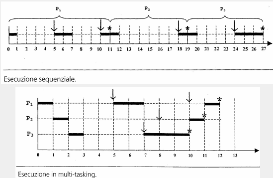
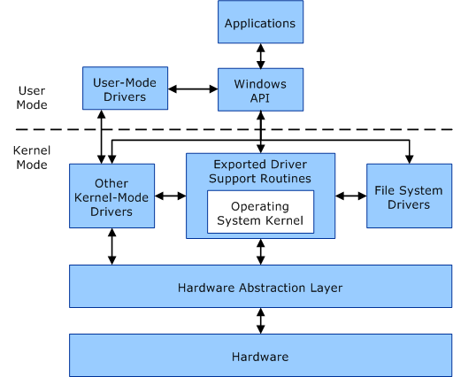

## Introduzione
Un **sistema operativo** è un insieme di programmi che operano sull'hardware di un **sistema di calcolo**.
**Sistema di calcolo**:
- dispositivi fisici (hardware)
- sistema operativo
- programmi di sistema (fornisce un'interfaccia verso l'hardware)
- programmi applicativi (applicazioni che risolvono problemi specifici)
- utenti (qualsiasi agente che usa il sistema di calcolo per risolvere un problema)

##### Sistema Operativo
- Programma che permette di eseguire i programmi utente
- Gestisce le risorse agli utilizzatori
- sempre in esecuzione nel sistema di calcolo
- viene chiamato Kernel

#### Hardware
La CPU e i device controller possono concorrere per l'utilizzo del bus e per l'accesso alla memoria tramite il bus.
Un device controller gestisce uno specifico device e usa un buffer locale per leggere e scrivere i dati che poi serviranno alla CPU. La sincronizzazione per l'utilizzo del buffer avviene tramite gli **interrupts**.
##### Interrupts
il segnale di interrupt viene inviato dal controller -> la CPU intercetta il segnale e determina il tipo di interrupt ->la CPU invoca la procedura di servizio associata all'interrupt -> lo stato della CPU viene salvato e ripreistinato al termine della procedura
normalmente si utilizza un vettore delle interruzioni

##### Memoria
Divisa in due parti:
- **Memoria Principale** (Random Access Memory), unica memoria di grandi dimensioni accessibile dalla CPU, **Volatile**
- **Memoria Secondaria** (Nastri, dischi, flash), compensa le limitazioni della memoria principale
###### Gerarchia della memoria
```
  (Faster)
  Registers
	  |
    Cache
	  |
 Main Memory
	  |
Electronic Disks
	  |
 Magnetic Disks
	  |
 Optical Disks
	  |
 Magnetic Tapes
   (Slower)
```

##### DMA (Direct Memory Access)
Le operazioni di accesso alla memoria da parte dei dispositivi di I/O vengono eseguite senza la CPU, ovvero il DMA controller ha il compito di trasferire i dati dal buffer del dispositivo I/O alla memoria centrale e viceversa. Al termine del trasferimento la CPU viene notificata dal DMA controller. Questa tecnica aumenta le prestazioni perché la CPU continua a lavorare durante il trasferimento dei dati.

#### Sistema Operativo
###### Sistemo operativio Monogrammato
Oltre al Sistema Operativo in memoria risiede al più un programma, quindi il sitema esegue un lavoro alla volta ed il sistema operativo deve solamente gestire il trasferimento da un job al sucessivo.

###### Sistemo operativio Multiprogrammato
In memoria riesiedono **contemporaneamente** più programmi da eseguire, il sistema operativo può eseguire un altro job mentre quello che era in esecuzione termina oppure si mette in attesa di un evento "esterno" ad esempio I/O.

##### Time Sharing
Tecnica utilizzata dai sistemi operativi multiprogrammati:
- i context switch tra job avvengono ad intervalli prestabiliti, non necessariamente in corrispondenza di operazioni di I/O
- il tempo della CPU è suddivisa tra più job
- i context switch fanno credere all'utente di utilizzare un sistema di calcolo dedicato solamente a lui
Consideriamo tre job P1, P2 e P3 che utilizzano sia la CPU ma eseguono anche operazioni di I/O.


#### Processo
Un **processo** è un'attività unitaria di elaborazione, caratterizzata da un singolo **flusso sequenziale di esecuzione**, uno **stato corrente** ed una collezione di **risorse** assegnate dal sistema.

- ogni utente può avere anche più di un job contemporaneamente in memoria centrale
- quando la memoria centrale non è sufficiente, alcuni processi vengono spostati sulla memoria di massa:
	- job pool, contenente processi che stanno eseguendo e i processi pronti all'esecuzione, ogni processo è visto come un blocco unico (non più utilizzata)
	- swap, contentente parti di processi non più utilizzate chiamate pagine, ogni processo è suddiviso in pagine e alcune possono stare in memoria centrale e alcune in memoria di massa
- Il sistema operativo sceglie quali processi caricare in memoria centrale (**job scheduling**)
- il sistema operativo sceglie quale processo eseguire in memoria centrale (**CPU scheduling**)

**processo** è un'entità del Sistema Operativo, un processo è l'istanza di un programma in esecuzione ed è l'unità minima di misura per le risorse,
ogni processo consiste della sua imamgine, contesto di esecuzione, memoria, files...; etimológicamente un processo è l'insieme degli step che il processore deve eseguire. Il processo consiste in uno o più threads che è l'unità di misura dello scheduler.

**job** è un'entità ad alto livello composta da più tasks, al giorno d'oggi job è un insieme di processi, mentre task indica un processo, un thread oppure un unità di lavoro eseguito dal processo o da un thread.

**Virtual Memory (Paging)** è un layer di astrazione fornito ad ogni processo, ad esempio se il sistema ha 2GB di RAM fisica con indirizzi da 0 a 2GB, un processo potrebbe vedere uno spazio di indirizzamento di 4GB tutto per lui. La gestione degli indirizzi da virtuali a fisici è gestita dal MMU(Memory Management Unit) che è gestita dal sistema operativo, suddivisa in pagine di una dimensione prefissata.

**Swapping** è il processo di spostare le pagine, dalla memoria centrale alla memoria di massa in un'area chiamata area di swap


##### Modalità di funzionamento
Una volta tutti i programmi condividevano la stessa memoria e potevano leggerci e scriverci quindi quando la complessità dei programmi e la sicurezza cominciano a diventare un problema si è deciso di avere una piccola porzione di codice sicura e con dei privilegi elevati e trattare i programmi come delle sandbox lasciandogli solo un accesso parziale che viene colmato da un'interfaccia.
Il kernel è la parte di codice sicura con i privilegi, il kernel ha più istruzioni a disposizione e può fare qualsiasi cosa sul sistema.
Tutti i programmi eseguiti dall'utente sono eseguiti in una modalità della CPU dove la CPU e l'accessso alla memoria sono limitate. Questi programmi devono utilizzare delle istruzioni specifiche per trasferire il controllo al kernel e quest'ultimo eseguirà le istruzioni controllando i permessi eccetera.
Questo porta a tre punti:
- Sicurezza: i programmi non possono accedere a cose che non dovrebbero
- Stabilità: isolando i programmi il kernel può gestire le risorse e terminare e pulire i programmi malfunzionantireddi
- compatibilità: il kernel fornisce API stabili per i programmi (per esempio la funzione```CreateFile```), può cambiare il modo in cui la funzione agisce under the hood, senza che il programma lo noti
Con questo proposito vengono introdotte due modalità di funzionamento, **user mode** e **kernel mode**
Per il corretto funzionamento delle due modalità è necessario che nella CPU sia presente un bit che abiliti o meno l'esecuzione delle istruzioni privilegiate.

| User-Mode                                                                                                             | Kernel-Mode                                                                                                                                                                                                          |
| --------------------------------------------------------------------------------------------------------------------- | -------------------------------------------------------------------------------------------------------------------------------------------------------------------------------------------------------------------- |
| Spazio di indirizzamento virtuale privato alla quale altri processi in user mode non hanno accesso                    | Tutti i programmi che sono eseguiti in kernel mode hanno un unico spazio di indirizzamento virtuale                                                                                                                  |
| Se un programma in esecuzione in user mode crasha non influisce sul funzionamento degli altri programmi in esecuzione | Se un programma o un driver crasha, tutto il sistema operativo crasha                                                                                                                                                |
| Un programma in esecuzione in user mode non ha accesso ai dati del sistema operativo (memory, storage, devices...)    | Un programma o driver in kernel mode ha accesso a tutta la memoria quindi se scrivesse su un indirizzo di memoria sbagliato potrebbe compromettere la memoria del sistema operativo o di un altro programma o driver |


Qui possiamo vedere la differenza in un'immagine dalla [guida della Microsoft](https://learn.microsoft.com/en-us/windows-hardware/drivers/gettingstarted/user-mode-and-kernel-mode))



Se un processo ha la necessità di accedere ad un servizio in kernel mode utilizza una **System Call**. La **system Call** genera un'interrupt. Quindi il processo viene messo in pausa, viene eseguita dal kernel la funzione ad alti privilegi richiesta, infine il controllo viene ritornato al processo in user mode.


#### Funzionalità offerte dal Sistema Operativo
###### Gestione dei Processi
- Creazione/Cancellazione
- Sospensione/Ripristino
- Meccanismi per la comunicazione tra processi
- Meccanismi per la sincronizzazione tra processi
- Gestione delle situazioni di stallo

###### Gestione della Memoria Centrale
- Tenere traccia di quali porzioni di memoria sono utilizzate e da quali processi sono utilizzate
- Decidere quali processi o parti di processi e dati debbano essere caricati in memoria principali e quali possono essere spostati in memoria secondaria
- Assegnare/Revocare spazio di memoria ai processi in base alle necessità

###### Gestione della Memoria di Massa e dei File
Le informazioni sono organizzate in **file**, che a loro volta sono organizzati nel file system. Il Sistema Operativo fornisce le funzionalità per la loro gestione
- Creazione/Cancellazione, accesso ai file e alle directory
- Associazione dei file ai dispositivi di memoria secondaria
- Gestione dell'affidabilità (creazione di backup)
Inoltre per la memoria secondaria:
- gestione dello spazioe libero
- assegnazione dello spazio
- scheduling del disco

###### Gestione dell'Input/Output
- gestire i buffer, zone di memoria utilizzate per scambiare dati con i dispositivi
- gestire il caching, spostamento dei dati in memorie più veloci
- gestire lo spooling, consentire l'esecuzione di processi e in contemporanea l'esecuzione di diverse operazioni di I/O
Il Sistema operativo nasconde il funzionamento specifico dei dispositivi hardware e ne permette l'utilizzo tipo "API" tramite l'utilizzo dei device-driver.

##### Protezione e Sicurezza
Protezione: controllo dell'accesso alle risorse del sistema da parte dei processi e utenti
Sicurezza: strategia di difesa delsistema da accessi o operazione dannose o distruttive (DOS, worm, virus, identity theft, theft of service....)

Perché questo accada è necessario che il Sistema Operativo sia in grado di distinguere gli utilizzatori, vengono infatti utilizzati gli UID (User Id) e i GID (Group Id)

Tra le proprietà che si vogliono garantire ci sono:
- Disponibilità: protezione contro le interruzioni di funzionamento
- Privatezza: assicurarsi che l'utente compia solamente accessi autorizzati ai dati e risorse
- Integrità dei dati: protezione dei dati da mnodifiche non autorizzate o incontrollate
- Autenticazione: gestione delle identità degli utenti e dell'autenticità dei loro dati e messaggi


## Scheduling
##### FCFS (First Come First Served)
**Selezione:** Si utilizza (First In First Out), il primo che arriva viene servito per primo
**Decisione:** non preemptive
**Vantaggi:**
	- semplice da implementare e senza overhead di gestione
	- non c'è la starvation
**Svantaggi:** 
	- il tempo di attesa è legato all'ordine di arrivo dei burst
	- il tempo di risposta può essere molto alto anche per il processi brevi
	- un processo CPU-bound tende a monopolizzare la CPU


##### SJF (Shortest Job First)
**Selezione:** si seleziona il processo che avrà il prossimo CPU-burst più breve
**Decisione:** non preemptive


##### SRTF (Shortest Remaining Time First)
**Selezione:** variante con preemption di SJF
	- si seleziona il processo che avrà il prossimo CPU-burst più breve
	- se P1 è running e P2 arriva in coda di ready con durata inferiore al tempo restante di P1 allora P2 sottrae la CPU a P1
**Decisione:** preemptive


##### SJF vs SRTF
- i processi con CPU-burst più breve sopravanzano gli altri
- SJF realizza il tempo di attesa medio migliore
- può esistere la starvation per i processi con CPU-burst lungo
- bisogna prevedere la durata dei CPU-burst


##### HRRF (Highest Response Ratio First)
**Selezione:** si seleziona il processo che ha il Response Ratio R maggiore,
	R = (t<sub>a</sub>+t<sub>s</sub>)/t<sub>s</sub>
	t<sub>a</sub> = tempo speso in attesa di ottenere la CPU
	t<sub>s</sub> = durata prevista del CPU-burst
**Decisione:** non preemptive
**Vantaggi:**
	- processi con CPU-burst brevi sono favoriti ma si tiene conto anche dell'età del processo
	- è un meccanismo di aging: evita la starvation
**Svantaggi:**
	- bisogna prevedere la durata dei CPU-burst


##### Stima delle durate dei CPU-burst
t<sub>n</sub> = durata ultimo CPU-burst
τ<sub>n</sub> = contributo storia remota burst
τ<sub>n+1</sub> = stima della durata del prossimo CPU-burst
τ<sub>n+1</sub>=αt<sub>n</sub>+(1−α)τ<sub>n</sub>


##### Scheduling con Priorità
**Selezione:** ad ogni processo viene assegnata una priorità, la CPU viene assegnata al processo ready con priorità più alta
**Decisione:** non preemptive o preemptive (un processo ready con priorità più alta può prendersi la CPU)

##### RR (Round Robin) (Scheduling circolare)
**Selezione:** serve il processo che attende da più tempo
**Decisione:** preemptive, però usa un timer che mette un processo in stato di ready da running
**vantaggi:** c'è una politica fair che evita la starvation
**svantaggi:** i processi CPU-bound utilizzano mediamente tutto il quanto di tempo, effettivamente utilizzando quindi per più tempo la CPU rispetto ai processi I/O-bound


##### Code Multiple con Retroazione
Ci sono più code con una priorità diversa ciascuna, ogni coda può avere un algoritmo di scheduling proprio. Inoltre c'è un algoritmo di scheduling tra code, che preleva il processo con priorità più alta e lo porta in stato di running


### Algoritmi che mirano all'equità di trattamento rispetto ai gruppi
##### FSS (Fair Share Scheduling)
**vantaggi:**
	- adatto ai sistemi multiutente
	- può trattare diversamente i processi di diversi utenti (esempio root o utente normale)


### Scheduling per Multiprocessori
###### Multielaborazione asimmetrica:
le attività di sitema sono affidate ad un unico processore, il **master server**
- il codice degli utenti è eseguito dagli altri processori
- difetto: il **master server** è un potenziale bottleneck del sistema
###### Multielaborazione simmetrica:
ogni processore ha uno scheduler che preleva i processi dalla ready-queue che può essere:
- di sistema: possibili race condition se più processori scelgono lo stesso task, serve mutua esclusione per l'accesso alla queue che può portare ad un bottleneck
- per-processor: serve un meccaniscmo per distribuire il carico tra le queue

Una CPU multicore ha più core nello stesso chip fisico
Il sistema operativo vede ogni core come un processore logico separato
Ogni core può eseguire più thread hardware contemporaneamente (Hyperthreading sulle CPU intel)
La presenza di multithreading a livello di core comporta ad un doppio livello di scheduling:
- scheduling software: assegnazione dei processi ai core
- scheduling hardware: assegnazione dei thread di un processo ad un thread hardware all'interno del core

In presenza di più core è necessario bilanciare in maniera equa il carico:
- push mitigation: un processo dedicato controlla periodicamente il carico di lavoro assegnato ai core e se necessario sottrae task ai core overloaded e li riassegna ai core meno carichi.
- pull mitigation: ogni cpu, quando è in idle, preleva un task da uno dei core overloaded

#### NUMA e Scheduling
- nelle architetture NUMA la CPU ha accesso veloce alla memoria locale e accesso lento (con più latenza) alla memoria remota di altre CPU.
- lo scheduler deve privilegiare la memoria locale per avere meno latenza
- però le tecniche di load-balancing potrebbero andare in contro a questa strategia

#### Sistemi Real-Time
Nei sistemi real-time bisogna rispettare delle deadline, quindi vengono utilizzati diversi algoritmi di scheduling
 - real-time soft: le deadline si possono violare
 - real-time hard: le deadline devono essere rispettate


#### Scheduling O(1) di linux
- utilizza preemption basato su priorità
- la priorità è divisa in due parti, una **real-time** gestita staticamente (da 0 a 99) e una **nice** gestita dinamicamente (da 100 a 140)
- la durata del quanto di tempo dipende dalla priorità, priorità alta tempo lungo e priorità bassa tempo corto